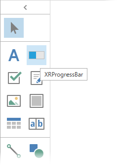

<!-- default badges list -->

<!-- default badges end -->
# Reporting for WPF - How to Register a Custom Control in the Designer's Toolbox

This example demonstrates how to add a custom control (XRProgressBar) to the [Report Designer](https://docs.devexpress.com/XtraReports/114104/desktop-reporting/wpf-reporting/end-user-report-designer-for-wpf)'s toolbox using the Designer's [`RegisterControl`](https://docs.devexpress.com/WPF/DevExpress.Xpf.Reports.UserDesigner.ReportDesigner.RegisterControl.overloads) method.

## Files to Review

* [MainWindow.xaml](./CS/ReportDesigner_AddingCustomControl/MainWindow.xaml) (VB: [MainWindow.xaml](./VB/ReportDesigner_AddingCustomControl/MainWindow.xaml))
* [MainWindow.xaml.cs](./CS/ReportDesigner_AddingCustomControl/MainWindow.xaml.cs) (VB: [MainWindow.xaml.vb](./VB/ReportDesigner_AddingCustomControl/MainWindow.xaml.vb))
* [XRProgressBar.cs](./CS/ReportDesigner_AddingCustomControl/XRProgressBar.cs) (VB: [XRProgressBar.vb](./VB/ReportDesigner_AddingCustomControl/XRProgressBar.vb))

## Documentation 

* [Add a Custom Control to the Report Designer Toolbox](https://docs.devexpress.com/XtraReports/116767/desktop-reporting/wpf-reporting/end-user-report-designer-for-wpf/api-and-customization/add-a-custom-control-to-the-report-designer-toolbox)
